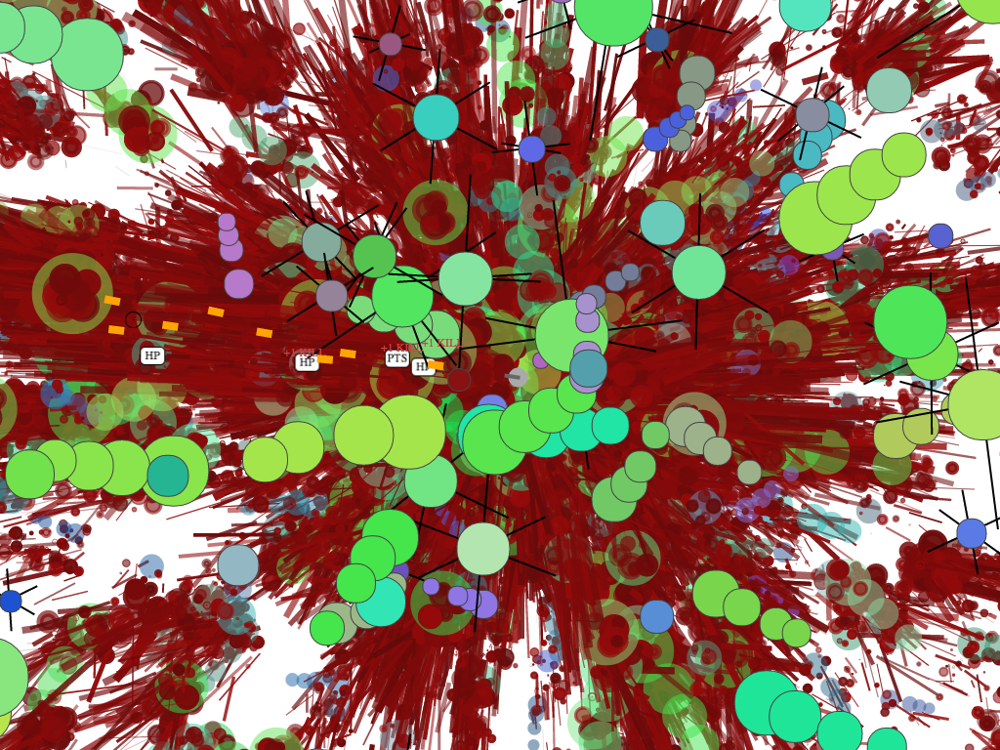

Bloody Mess
===========

A javascript game written in 48 hours for the Ludum Dare 31 competition.

Controls
--------

W,S,A,D or arrows for movement and mouse for aiming/shooting.

Where to Play?
--------------

To play the game visit [http://karol.io/bloody-mess](http://karol.io/bloody-mess)
